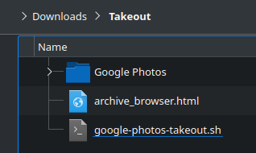

# A script that — just works!

This script fixes the image and video metadata of Google Photos Takeout, so that it can be used with other software. It handles both the DateTimeOriginal and GPS EXIF fields.

No javascript or any other bs.

## Dependencies

- bash
- exiftool
- jq

## Usage

1. Download and extract your [Google Photos Takeout](https://takeout.google.com/)
2. Download [the script](https://github.com/Zaczero/google-photos-takeout.sh/raw/main/google-photos-takeout.sh) and put it inside the `Takeout` folder
3. Run it

## [LICENSE](https://github.com/Zaczero/google-photos-takeout.sh/blob/main/LICENSE)
